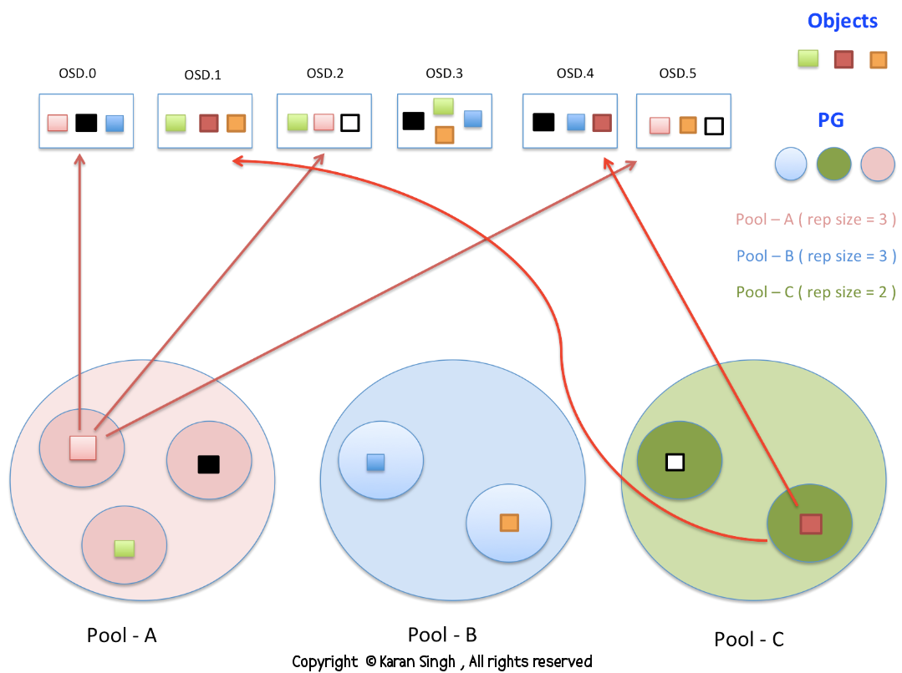
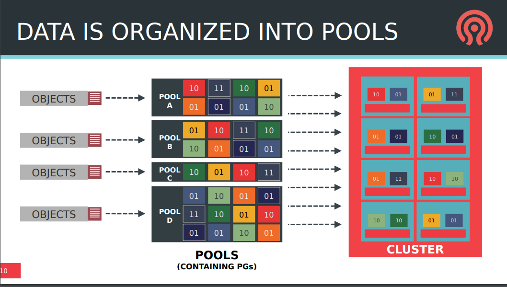
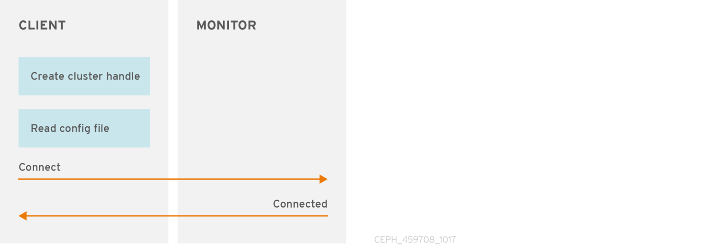
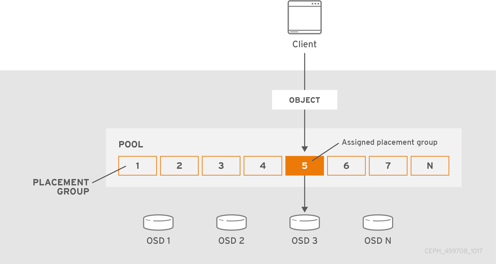
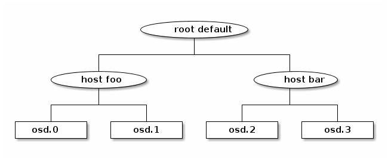

## DATA PLACEMENT 


## 1. DATA PLACEMENT OVERVIEW


- Object : Object is the smallest unit of data storage in ceph cluster , Each & Everything is stored in the form of objects , thats why ceph cluster is also known as Object Storage Cluster. Objects are mapped to PG , and these Objects / their copies always spreaded on different OSD. This is how ceph is designed. 

- Ceph lưu trữ và replicate các data object trên một  cụm  một cách linh động và có kế hoạch : 
    - Pools : ceph lưu trữ dữ liệu trong các pool, đây là logical group để chữa các dữ liệu . Pool quản lý các placement group , số lượng replicate, và CRUSH Rule cho pool . Để lưu trữ dữ liệu vào pool cần thao tác truyên người dùng được ủy quyền.
    - Placement Groups: CEPH sẽ không mapping location cụ thể các object trên các ODS, thay vi đó sẽ mapping vào placement group ( PG ). Placement sẽ đặt các object các object cùng 1 nhóm . Placement Group là các nhóm nhỏ được phân chia từ các pool, các Placement Group sẽ gom các object cùng thuộc tính vào nhóm, Placment group giúp việc cân tằng tải. Mặc định các PG sẽ được gán vào OSD chính, nếu OSD fail hoặc cụm thực hiện cân bằng tải dữ liệu các PG sẽ được di chuyển hoặc sao chép. 
    - CRUSH Maps : sẽ giảm hiện tượng nghẽn cổ chai dựa vào thuật toán crush, cung cấp khả năng xác định nơi lưu dữ liệu ( PD group), cách sao lưu dữ liệu và nơi các bản ghi  sao chép sẽ được lưu trữ . CRUSH Map chứa một bản đồ về các device vật lý có trong cụm để xác định nơi dữ liệu có thể được đặt và cách dữ liệu có thể đảm bảo qua các failure domain


- A PG is spreaded on multiple OSD , i.e Objects are spreaded across OSD. The first OSD mapped to PG will be its primary OSD and the other ODS's of same PG will be its secondary OSD.








## 2. Ceph Pool

- Việc khởi tạo 1 pool mới tương đương với việc khởi tạo một I/O interface cho các client để lưu trữ dữ liệu .Ceph client  làm việc với Cluster rất đơn giản : bắt tay và kết nối với cụm, khởi tạo I/O tuy thuộc vào reading và wrinting để lưu trữ object và các thuộct tính bổ sung. Để kết nối tới Cluster storage, các client cần yêu cầu có ít nhất 3 trường : "name_cluster"  + "mon_address" và secret key - user cho việc xác thực. 



- Khi khởi tạo một cluster mới, Ceph sẽ sử dụng default pool  để lưu trữ dữ liệu . Một pool cung có thể cung cấp các khả năng sau đây :
    - Resilience : chỉ định số OSD có thể ở status fail ở mode replicas . Ví dụ với   replicated pools sẽ xác định số lượng số OSD = 3 , tương ứng với số bản copy = 3, nêu số ODS ở status fail nhỏ hơn 2, pool sẽ ngừng hoạt động. 
    - Placement Groups : chỉ số lượng placement groups  cho pool 
    - CRUSH Rules: khi đặt dữ liệu vào một rule , vị trí của dữ liệu và bản sao trong cụm được điều chỉnh dựa vào các rule
    - Snapshots : khả năng snapshot nhanh 1 pool.
    - Quotas: cung cấp khả năng giới hạn số byte cũng như số object có thể lưu trữ trên pool .

    

- Xem các pool đang có
```
[root@ceph_node1 ~]# ceph osd lspools
1 rbd_pool
2 pool_block
```

- Cấu hình số PG và PGD mặc định
```
osd pool default pg num = 100
osd pool default pgp num = 100
```

- Khởi tạo pool mới
```
ceph osd pool create {pool-name} {pg-num} [{pgp-num}] [replicated] \
     [crush-rule-name] [expected-num-objects]
ceph osd pool create {pool-name} {pg-num}  {pgp-num}   erasure \
     [erasure-code-profile] [crush-rule-name] [expected_num_objects]

ceph osd pool create pool_block 100 100  replicated

```
- Trong đó : 
    - {pool-name} : tên của pool
    - {pg-num} :  tổng số placment group của group ( bao gồm số placement group được sử dụng và không sử dụng)
    - {pgp-num} : tổng số placement groups được sử dụng  (thông thường bằng tổng số pg-num )
    - {replicated|erasure} : replicated - cho phép các pool phục hồi object bằng cách lưu trữ nhiều bản sao cảu Object. erasure cho phép thực hiện cơ chế  RAID5 cho các object. [](https://vi.wikipedia.org/wiki/RAID#/media/File:RAID_5.svg)
    - crush-rule-name : crush rule được sử dụng cho pool
    - [expected-num-objects]: số object trên pool


- Gắn Pool vào một application. Pool cần phải được liên kết với một ứng dụng trước khi sử dụng. Ví dụ với pool được gắn vào RBD sẽ được khởi tạo bằng rbd tool. Cho phép pool cấm vận các client không được acces vào pool type. CephFS uses the application name "cephfs", RBD uses the application name "rbd", and RGW uses the application name "rgw".
```
ceph osd pool application enable {pool-name} {application-name}


ceph osd pool application enable pool_block rbd

```


- Pool quota
```
ceph osd pool set-quota {pool-name} [max_objects {obj-count}] [max_bytes {bytes}]


ceph osd pool set-quota pool_block max_objects 100 ## set

ceph osd pool set-quota pool_block max_objects 0  ## unset 
```

- Để xoá một pool, cần cấu hình trên MON cho phép xoá pool
```
ceph tell mon.* injectargs --mon-allow-pool-delete=true ## allow 

ceph tell mon.* injectargs --mon-allow-pool-delete=false ## denied


```

- Thực hiện xoá Pool
```

Thêm cấu hình   'mon allow pool delete = true' vào file cấu hình. Rest dịch vụ "systemctl restart mon.target"

ceph osd pool delete {pool-name} [{pool-name} --yes-i-really-really-mean-it]


[]# ceph osd pool delete pool_block pool_block --yes-i-really-really-mean-it
pool 'pool_block' removed


```


- Đổi tên Pool
```
ceph osd pool rename {current-pool-name} {new-pool-name}

ceph osd pool rename {current-pool-name} {new-pool-name}

[]# ceph osd pool rename rbd_pool rbd_pool_1
pool 'rbd_pool' renamed to 'rbd_pool_1'

```

- Xem thông kê Pool
```
rados df
``` 

- Tạo snapshot cho pool
```
ceph osd pool mksnap {pool-name} {snap-name}


[]# ceph osd pool mksnap rbd_pool_1 snap_1
created pool rbd_pool_1 snap_1

```

- Xoá một snap trên pool
```
ceph osd pool rmsnap {pool-name} {snap-name}


[]# ceph osd pool rmsnap rbd_pool_1 snap_1
```

- Set Pool Value 
```
ceph osd pool set {pool-name} {key} {value}


ceph osd pool set rbd_pool_1 size 3
ceph osd pool set rbd_pool_1 min_size 2


```

- Một số key value . 

|Key|Value|
|---|---|
| compression_algorithm| `lz4`, `snappy`, `zlib`, `zstd`|
|compression_mode|`none`,  `passive`,  `aggressive`,  `force`|
|compression_min_blob_size| số byte của object tối thiểu cần thực hiện nén|
|compression_max_blob_size|byte ( interger )|
|size|số replica|
|min_size| số replicat tối thiểu|
|pg_num| số placment group|
|pgp_num| số placment group được sử dụng |
|crush_rule| crush rule áp dụng cho các placment|
|Xem thêm |http://docs.ceph.com/docs/mimic/rados/operations/pools/#set-pool-values|

- Xem value của Pool
```
ceph osd pool get {pool-name} {key}

[]# ceph osd pool get rbd_pool_1 size

```

- Xem các cấu hình của Pool
```
ceph osd dump | grep "rbd_pool_1"

```


## 3.  Erasure Code Pools

- Tuỳ thuộc vào yêu cầu đồ bền của dữ liệu việc xác định cách lưu trữ dữ liệu có thể được lựa chọn. Đồ bền của dữ liệu có nghĩa là khả năng đáp ứng dữ liệu mà không có mất mát trong trường hợp mất hoặc nhiều hơn OSD.
- Ceph lưu trữ dữ liệu trên các pool và sẽ có 2 kiểu pool có thể lựa chọn :
    - replicated
    - erasure-coded

- Ceph sử dụng pool replicated làm mặc định cho các object, có nghĩa rằng các bản copy của dữ liệu có thể trải đề trên các OSD. 


- erasure-coded pool đáp ứng nhu cầu bên vững nhu cầu bền vững dữ liệu hơn replicated với thụât toán riêng, sử dụng nhiều diskspace đồng thời tăng khả năng bền vững. 


- https://access.redhat.com/documentation/en-us/red_hat_ceph_storage/3/html-single/storage_strategies_guide/index#erasure_code_poolsfa

## 4 Cache Tiering 

### PENDING 

## 5. PLACEMENT GROUPS

- Tính số PG dựa vào số OSD
    - Less than 5 OSDs set pg_num to 128
    - Between 5 and 10 OSDs set pg_num to 512
    - Between 10 and 50 OSDs set pg_num to 1024
    - If you have more than 50 OSDs, you need to understand the tradeoffs and how to calculate the pg_num value by yourself
    - For calculating pg_num value by yourself please take help of pgcalc tool

max = (mon_max_pg_per_osd 250 * num_in_osds 3)


### 4.1 : HOW ARE PLACEMENT GROUPS USED ?

- Một hệ thống lớn với số lượng lớn các object sẽ không thể theo dõi từng object thay vì đó, Ceph chia nhỏ các pool bằng các placement group , gắn từng object riêng lẻ cho tầng các placement group , các placement group sẽ được gắn vào OSD chính . Nếu một OSD đi vào trạng thái fail. cluster sẽ tự động cân bằng lại bằng các thực hiện replicate các placement group, với pool size bằng 2 thì placment sẽ cố gắng copy các oject trong các placement group 2 lần .


- Khi CRUSH thực hiện gán placment group  tới một OSD, nó sẽ tìm kiếm các OSD phù hợp và xác định OSD primary. Primary OSD thực hiện sử dụng CRUSH để tìm kiếm các secondary OSD  sau đó thực hiện copy  placement group’s contents . 


- Khi primary thi vào trạng thái fail, CRUSH sẽ thực hiện chuyeẻn đổi primary OSD, thực hiện quyền nắm giữ các placement group và thực hiện sao chép các object sang OSD mới. 


### 4.1 : Data Durability

- Việc cung cấp nhiều các Placment group giúp việc khôi phục dữ liệu nhanh chóng. Càng nhiều placment dữ liệu được trải đều trên nhiều nhóm, khi thực hiện replicate data sẽ không phải chịu tình huống nghẽn cổ chai. Ví dụ nếu pool có 100GB có số Placement group là 20 , thì mỗi lần replicate pool hạ tầng mạng sẽ phải chịu tải 5GB dữ liệu, nếu tăng số lượng placment group lên 50 , mỗi lần replicate đường mạng sẽ phải chịu tải 2GB dữ liệu.

### 4.2 :  Data Distribution within a pool

- Các object trong pool được phân bố đều trên các placement group. Khi CRUSH thực hiện  tính toán placement group cho mỗi object, CRUSH sẽ không biết được thật sự có bao nhiêu data đã được lưu trữ sẵn dưới các OSD, việc này được quản lý bởi "ratio", tỉ lệ giữa số placement group và cố OSD sẽ ảnh hưởng đến việc phân phối dữ liệu

- Ví dụ : trên một pool có replica size 3 chứa một placement group có 10 OSD, trong trường hợp này CRUSH sẽ chỉ sử dụng đến 3 OSD. Khi số placement group được thêm, các object sẽ được trải trều trên các OSD. CRUSH sẽ thực hiện chia để các data trên các OSD của các placement group . 


- Pending


### 4.3 : CHOOSING THE NUMBER OF PLACEMENT GROUPS

- Pending


## 5. CRUSH

### 5.1. Intro to CRUSH 

- CRUSH bao gồm một map mô tả mô hình vật lý của Ceph Cluster và các rule mà cách dữ liệu được đặt xuống các thiết bị trong mô hình này. 
- CRUSH Map bao gồm ít nhất một hệ thống phân cấp gồm "node"  và "lá".  Node được gọi là bucket , bao gồm tập hợp các vị trí lưu trữ mà được định nghĩa bởi type.  Lá trong crush map gồm một storage device trong danh sách các storage device. Một lá luôn luôn được nằm trong một bucket.  CRUSH map cũng bao gồm các list rule mà định nghĩa cách CRUSH lưu trữ và xuất dữ liệu
- Thuật toán CRUSH thực hiện phân tán dữ liệu trên các storage device dựa vào các weigh value của chúng,. CRUSH thực hiện phân tán và sao chép lưu trữ trên cluster dựa vào các cluster map do người quản trị định nghĩa..  Để ánh xạ placement group tới các OSD thông qua failure domain hay performance domain , CUSH map sẽ định nghĩa một danh sách phân cấp gồm các bucket type. Failure domain gồm : hosts, chassis, racks, power distribution units, pods, rows, rooms, and data centers.. Performance fomain gồm failure domain và OSD 


### 5.2. Placing Data Dynamically

- Ceph client vào Ceph OSD đều sử dụng CRUSH map và thuật toán của nó
	- Ceph client : crush cho phép ceph client giao tiếp trực tiếp với các OSD, tránh khỏi việc làm việc thông qua các centralized hay broker. ảnh hướng đến hiệu năng - nghẽn cổ chai  hay xuất hiện một single point of failure trong hệ thống. 
	- Ceph OSD : Ceph OSD sẽ sử dụng CRUSH để biết thông tin về hệ thống, , được sử dụng cho việc re-balance, replication, backfilling và recovery và thay thế công việc này cho các Ceph client

### 5.3. Establishing Failure Domains
- In [computer networking](https://en.wikipedia.org/wiki/Computer_networking "Computer networking"), a **failure domain** encompasses a section of a network that is negatively affected when a critical device or network service experiences problems
- Để giảm giải năng mất mát dữ liệu  đồng thời trên các failure domain, có thể xây dựng các bản sao dữ liệu được đặt trên kệ, rack, nguồn, controller, vị trí địa lý khác nhau . 

### 5.4. Establishing Performance Domains
- Ceph có thể hỗ trợ nhiều hệ thống phân cấp bằng cách chia  theo các type của phần cứng - chủ yếu dựa vào hiệu suất của phần cứng. CRUSH có thể xây dưngj một hệ thống phân cấp cho HDD và một hệ thống phân cấp khác cho SSD. 

### 5.5. CRUSH LOCATION

- Các vị trí của object được đặt trong hệ thống trong hệ thống phân cấp của CRUSH map được gọi là `crush localtion`. Các vị trí này bao gồm các cặp key=value mô tả vị trí 
```
root=default row=a rack=a2 chassis=a2a host=a2a1
```

- Keyname của vị trí được quy định bởi CRUSH type. Mặc định bao gồm : root, datacenter, room, row, pod, pdu, rack, chassis and host
- Mặc định localtion của các object được đặc tại ``root=default  host=HOSTNAME``

### 5.6. CRUSH STRUCTURE

- Device trong CRUSH MAP gồm : `ceph-osd` daemons hoặc chia theo các device class
- Bucket trong CRUSH MAP bao gồm các type : osd (or device), host, chassis, rack, row, pdu, pod, room, datacenter, region, root. 
- Các Bucket sẽ có các weigh được liên kết, trong các bucket sẽ có các giá trị riêng lẻ cho từng osd ( device ) của chúng.  Các buck item weigh trong này cho biết tương đối tổng dữ liệu mà device hoặc bucket có thể lưu trữ. weight của các bucket sẽ bằng weight các osd ( device ) được chứa bởi nó cộng lại . Thông thường đơn vị của weigh sẽ là terabytes (TB). . Ví dụ 1 weigh sẽ bằng 1 TB



- CRUSH map của cluster : bao gồm class , weigh  và hệ thống phân cấp 
```
[]# ceph osd crush tree
ID CLASS WEIGHT  TYPE NAME           
-1       0.09760 root default        
-3       0.04880 host ceph_node1 
 0   hdd 0.04880         osd.0       
-5       0.04880 host ceph_node2 
 1   hdd 0.04880         osd.1       
```


### 5.7. Rule
-  Rule định nghĩa các chính sách cách mà dữ liệu được phân tán trên các storage device có trong crush map . Crush định nghĩa các chính sach cho placement,  replica , min size, normal size hoặc phân tán để xác định được cách dữ liệu được đặt vào trong hồ chứa.
- Rule có thể được định nghĩa thông qua CLI hoặc file cấu hình bằng cách chỉnh pool type ( replicated và erasure coded) , failure domain và device class. 
- Xem rule được định nghĩa trong cụm
```
[]# ceph osd crush rule ls
replicated_rule

```


- Dump content của từng rule
```
[]# ceph osd crush rule dump {rule_name}

```

- Dump content của rule 
```
[]# ceph osd crush rule dump
[
    {
        "rule_id": 0,
        "rule_name": "replicated_rule",
        "ruleset": 0,
        "type": 1,
        "min_size": 1,
        "max_size": 10,
        "steps": [
            {
                "op": "take",
                "item": -1,
                "item_name": "default"
            },
            {
                "op": "chooseleaf_firstn",
                "num": 0,
                "type": "host"
            },
            {
                "op": "emit"
            }
        ]
    }
]

```

### 5.8. Device Classs
- Mặc định OSD được set device class khi chúng khởi động bao gồm hdd, ssd,  nvme dựa vào backend của chúng. 

- Để thay đổi device class thực hiện hoá device class trước
```
ceph osd crush rm-device-class <osd-name> [...]

[]# ceph osd crush rm-device-class osd.0
done removing class of osd(s): 0

```
- Tuỳ chỉnh device class  của OSD
```
ceph osd crush set-device-class <class> <osd-name> [...]

[]# ceph osd crush set-device-class ssd osd.0
set osd(s) 0 to class 'ssd'

```

### 5.9. WEIGHT SET

```
[root@ceph_node3 ~]# ceph osd tree
ID  CLASS WEIGHT  TYPE NAME           STATUS REWEIGHT PRI-AFF 
-16             0 rack rack2                                  
 -1       0.53879 root default                                
 -3       0.48999     host ceph_node1                         
  0   ssd 0.48999         osd.0           up  1.00000 1.00000 
 -5       0.04880     host ceph_node2                         
  1   ssd 0.04880         osd.1           up  1.00000 1.00000 
-10             0     host ceph_node3                         

```


- Crush weight hay là bucket item weight ( chỉ số 2 ) là mức tài nguyên của các item trong bucket có thể chịu tải . Các weith này thể hiện sự khác biệt năng lực thiết bị ( storage device ) có trong bucket. Thông thường với weight 1.0 thì tương ứng với 1TB storage , 0.5 sẽ tương ứng vơi 500GB . Các bucket cao hơn ( root backet ) sẽ có weigh sẽ là tổng của các các item có trong hệ thống phân cấp của backup này. Các weight được gắn kết với OSD khi tham iga vào cụm, nhưng người dùng có thể tính toán và  tuỳ chỉnh thông số này để phù hợp với hiệu năng của các OSD. Nói chung Crush weight được sử dụng để xác định được số data có thể phân bổ xuống các bucket item .
Command : `ceph osd crush reweight`


- Chỉnh sửa  OSD weight. Sử dụng cho việc cân bằng tải , reweight sẽ là số % dữ liệu có thể viết trên các OSD dựa trên crúsh weight , khi OSD ở trạng thái out thì sẽ chuyển về 0 . Tuỳ vào hiệu năng của các OSD thì sẽ chọn các phân tán dữ liệu trên cách dữ liệu này, nếu là 0.5 thì CRUSH có thể viết lên trên các OSD 50% số chịu tải được khai báo ở Crush weight và các OSD còn lại sẽ là 1.0 . 
Command : ceph osd reweight 


- Weigh  set là chỉ số được sử dụng khi tính toán vị trí của dữ liệu  thay cho sử dụng chỉ số weight bình thường . 
- Có  2 kiểu weigh được hỗ trợ : 
	- **compat** weight : cho  phép đạt các weigh trên từng device và node trong cluster.
	- **per-pool** weight : cho phép đặt weigh trên từng pool . 


## 5.10 MODIFYING THE CRUSH MAP WITH CLI

- Thêm và move OSD trên Clustermap
```
ceph osd crush set {name} {weight} root={root} [{bucket-type}={bucket-name} ...]

[]# ceph osd crush set osd.0 1.0 root=default datacenter=dc1 room=room1 row=foo rack=bar host=foo-bar-1fpt
```


- Chỉnh sửa  Osd weight. Sử dụng cho việc cân bằng tải , khi OSD trong cụm 


- Chỉnh sửa OSD weight trong CRUSH MAP ( backet item )
```
ceph osd crush reweight {name} {weight}

[]# ceph osd crush reweight osd.0 .48
```

- Xoá OSD khỏi map
```
ceph osd crush remove osd.0
```

- Thêm bucket vào map
```
ceph osd crush add-bucket {bucket-name} {bucket-type}


[]# ceph osd crush add-bucket dc_hn datacenter
```

- Move bucket
```
ceph osd crush move {bucket-name} {bucket-type}={bucket-name}, [...]

[]# ceph osd crush move dc_hn rack=rack1
```

- Xoá bucket
```
ceph osd crush remove {bucket-name}

[]# ceph osd crush remove rack1 rack2
```

- Khởi tạo và xoá compat weight
```
ceph osd crush weight-set create-compat
ceph osd crush weight-set reweight-compat {name} {weight}

[]# ceph osd crush weight-set reweight-compat osd.0 0.48

ceph osd crush weight-set rm-compat
```

- Khởi tạo pool weigh : Bao gồm 2 mode : flat - một weigh duy nhất cho các device và bucket.  và positional - weigh cho mỗi device và bucket ## Minic not supported
```
ceph osd crush weight-set create {pool-name} {mode}


[]# ceph osd crush weight-set create rbd_pool_1 positional
```


- Trong một repicate pool, điều quan trọng là xác định được failure domain. Ví dụ nếu host được chọn là failure domain thì Crush sẽ thực hiện repicate  trên một host khác, tương tụ với rack hay các thành phần khác trên bucket.
- Khởi tạo và rule cho replicated pool. 
```
ceph osd crush rule create-replicated {name} {root} {failure-domain-type} [{class}]

[]# ceph osd crush rule create-replicated ssd_replicate rack2 host ssd

```

- Trong đó :
    - name : tên của crush rule
    - root : root node trong hệ thống phân cấp ( bucket ) mà các node bên dưới dữ liệu sẽ được đặt.
    - failure-domain-type : các node sẽ ở là failure-domain-type , thực hiện repicate dữ liệu.
    - class : device class mà dữ liệu sẽ ở trên.


### 5.11. MODIFYING THE CRUSH MAP MANUAL 


## PENDING 


## 10 . Tài liệu

- https://blog.dachary.org/2017/05/12/an-algorithm-to-fix-uneven-crush-distributions-in-ceph/
- http://www.shalandis.com/original/2016/05/19/CEPH-CRUSH-algorithm-source-code-analysis/
- https://ceph.com/planet/predicting-which-ceph-osd-will-fill-up-first/
- http://doc.iihe.ac.be/wiki/t2b/index.php/CephBasics
- https://www.jianshu.com/p/bfcf91fd10da
- https://blog.csdn.net/changtao381/article/details/49073631
- https://blog.csdn.net/weixin_34334744/article/details/87514992